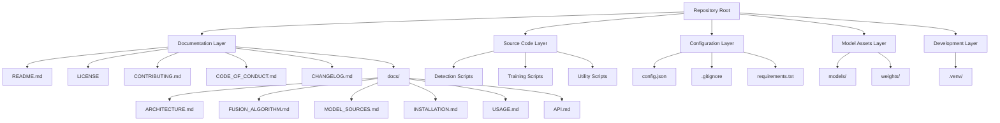
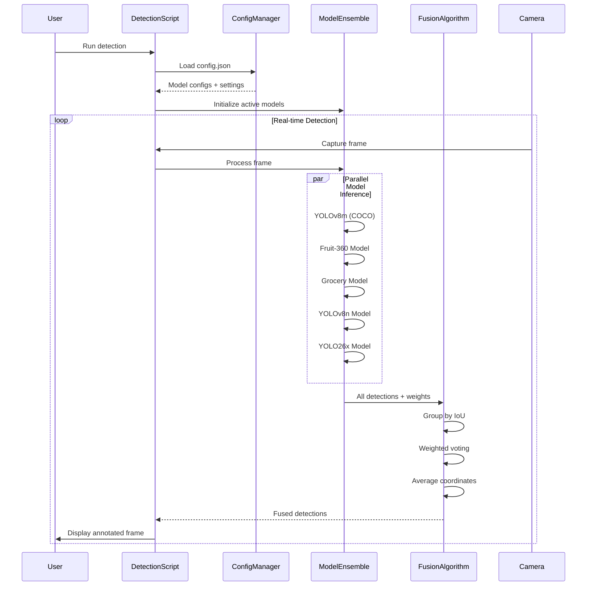
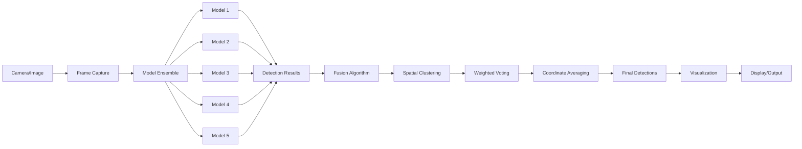
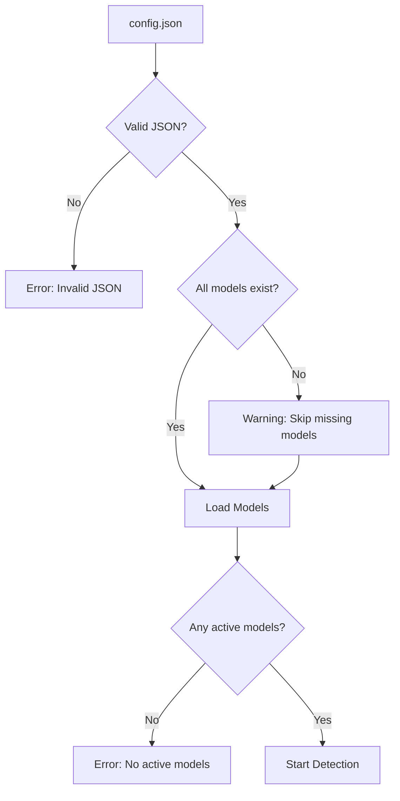

# System Architecture

## Overview

This document describes the architecture of the multi-model fusion detection system for identifying groceries, vegetables, and fruits. The system uses YOLOv8 with ensemble learning to combine predictions from multiple pre-trained models through weighted voting, providing more accurate and robust detection results than any single model.

## High-Level Architecture



## System Components

### 1. Detection Pipeline

The detection pipeline orchestrates the entire process from frame capture to final output:



### 2. Configuration Manager

Manages system configuration from `config.json`:

**Responsibilities:**
- Load and validate configuration file
- Provide model settings (paths, weights, active status)
- Supply detection parameters (IoU threshold, confidence threshold, minimum votes)
- Handle configuration errors gracefully

**Configuration Structure:**
```json
{
  "models": [
    {
      "name": "YOLOv8m (COCO)",
      "path": "models/yolov8m.pt",
      "weight": 1.0,
      "active": true
    }
  ],
  "detection": {
    "iou_threshold": 0.5,
    "confidence_threshold": 0.25,
    "min_votes": 2
  }
}
```

### 3. Model Ensemble

Manages multiple YOLO models and performs parallel inference:

**Responsibilities:**
- Load active models from configuration
- Perform parallel inference on input frames
- Collect and normalize detection results
- Handle model loading errors

**Model Types:**
- YOLOv8m (COCO): General object detection
- Fruit-360 Model: Specialized fruit detection
- Grocery Model: Grocery item detection
- YOLOv8n: Lightweight general detection
- YOLO26x: High-accuracy detection

### 4. Fusion Algorithm

Combines predictions from multiple models using spatial clustering and weighted voting:

**Responsibilities:**
- Group overlapping detections by IoU
- Perform weighted voting for class labels
- Average bounding box coordinates
- Filter results by minimum vote threshold

**Key Parameters:**
- IoU Threshold: Determines when detections overlap (default: 0.5)
- Minimum Votes: Required model agreement (default: 2)
- Model Weights: Influence of each model's predictions

See [FUSION_ALGORITHM.md](FUSION_ALGORITHM.md) for detailed algorithm explanation.

## Data Flow



## Repository Structure

```
chefvision/
├── docs/                           # Extended documentation
│   ├── ARCHITECTURE.md            # This file - system design
│   ├── FUSION_ALGORITHM.md        # Detailed algorithm explanation
│   ├── MODEL_SOURCES.md           # Model provenance
│   ├── INSTALLATION.md            # Setup instructions
│   ├── USAGE.md                   # Usage examples
│   └── API.md                     # API reference
│
├── models/                         # Pre-trained model files
│   ├── yolov8m.pt                 # YOLOv8 medium (COCO)
│   ├── fruit_360.pt               # Fruit-360 trained model
│   ├── grocery.pt                 # Grocery detection model
│   ├── yolov8n.pt                 # YOLOv8 nano
│   ├── yolo26x.pt                 # YOLO26x model
│   └── README.md                  # Model management guide
│
├── weights/                        # Training output directory
│
├── detect_fruits.py               # Basic detection script
├── detect_fruits_advanced.py      # Advanced detection with options
├── detect_fusion.py               # Fusion detection implementation
├── detect_multi_model.py          # Multi-model detection
├── download_models.py             # Model download utility
├── train_model.py                 # Training script
├── train_model.ipynb              # Training notebook
│
├── config.json                    # System configuration
├── requirements.txt               # Python dependencies
│
├── README.md                      # Main documentation
├── LICENSE                        # MIT License
├── CONTRIBUTING.md                # Contribution guidelines
├── CODE_OF_CONDUCT.md            # Community standards
├── CHANGELOG.md                   # Version history
├── TRAINING.md                    # Training guide
│
└── .gitignore                     # Git exclusions
```

## Component Interactions

### Detection Script Workflow

1. **Initialization Phase:**
   - Load configuration from `config.json`
   - Initialize active models from configuration
   - Set up camera or image source
   - Configure detection parameters

2. **Detection Phase:**
   - Capture frame from camera or load image
   - Pass frame to each active model in parallel
   - Collect all detection results
   - Apply fusion algorithm to combine results
   - Filter by confidence and minimum votes

3. **Output Phase:**
   - Draw bounding boxes on frame
   - Add class labels and confidence scores
   - Display or save annotated frame
   - Log detection statistics

### Configuration Flow



## Performance Considerations

### Inference Optimization

**Target Performance:**
- Real-time detection: 15-30 FPS on M1 Mac
- Latency: < 100ms per frame for 5 models

**Optimization Strategies:**
1. Parallel model inference using thread pools
2. Frame skipping for high-resolution cameras
3. Model quantization for faster inference
4. GPU acceleration when available
5. Efficient memory management

### Memory Management

**Resource Usage:**
- Model memory: ~500MB for 5 models
- Frame buffer: ~10MB for 1280x720 resolution
- Detection cache: ~1MB per frame

**Strategies:**
- Lazy model loading (load only active models)
- Frame buffer reuse
- Periodic garbage collection
- Configurable model count

## Security Architecture

### Data Privacy

All processing happens locally:
- No network requests during detection
- No frame storage by default
- Camera feed never transmitted
- User controls all data

### Model Security

Model integrity considerations:
- Document trusted model sources
- Recommend checksum verification
- Sandboxed model loading
- Clear provenance documentation

See [MODEL_SOURCES.md](MODEL_SOURCES.md) for model provenance details.

## Extensibility

### Adding New Models

1. Train or obtain a YOLOv8-compatible model
2. Place model file in `models/` directory
3. Add model configuration to `config.json`
4. Set appropriate weight and active status
5. Run detection script

### Custom Fusion Strategies

The fusion algorithm can be extended:
- Custom IoU calculation methods
- Alternative voting mechanisms
- Confidence-based weighting
- Class-specific fusion rules

### Integration Points

The system can be integrated with:
- Web applications via REST API
- Mobile apps via Python backend
- Edge devices via model optimization
- Cloud services via containerization

## Technology Stack

### Core Dependencies

- **ultralytics** (≥8.0.0): YOLOv8 implementation
- **opencv-python** (≥4.8.0): Computer vision and camera access
- **numpy** (≥1.24.0): Numerical operations

### Development Tools

- **pytest**: Testing framework
- **black**: Code formatting
- **flake8**: Linting
- **mypy**: Type checking

### System Requirements

- Python 3.8+
- macOS (M1/M2 optimized) or Linux
- 8GB RAM minimum (16GB recommended)
- Camera device (for real-time detection)
- 2GB disk space for models

## Future Architecture Considerations

### Scalability

- Distributed model inference across multiple machines
- Cloud-based model serving
- Batch processing for large datasets
- Real-time streaming support

### Advanced Features

- Model performance monitoring
- Automatic model selection based on scene
- Adaptive fusion weights based on confidence
- Multi-camera support
- Video file processing

### Integration Enhancements

- REST API for remote detection
- WebSocket support for real-time streaming
- Docker containerization
- Kubernetes deployment support
- CI/CD pipeline integration

## Related Documentation

- [FUSION_ALGORITHM.md](FUSION_ALGORITHM.md) - Detailed algorithm explanation
- [MODEL_SOURCES.md](MODEL_SOURCES.md) - Model provenance and training data
- [INSTALLATION.md](INSTALLATION.md) - Setup instructions
- [USAGE.md](USAGE.md) - Usage examples and tutorials
- [API.md](API.md) - API reference for programmatic usage
- [TRAINING.md](../TRAINING.md) - Model training guide
