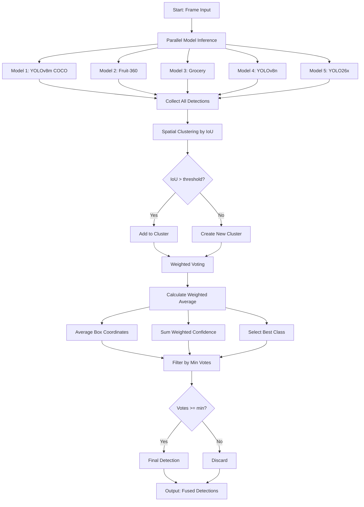

# Fusion Algorithm Documentation

## Overview

The fusion algorithm combines predictions from multiple YOLO models to produce more accurate and robust object detections. By leveraging ensemble learning through weighted voting and spatial clustering, the system achieves better performance than any single model alone.

## Algorithm Concept

The fusion process operates in two main phases:

1. **Spatial Clustering**: Group overlapping detections from different models based on Intersection over Union (IoU)
2. **Weighted Fusion**: Combine clustered detections using weighted voting to determine final class, confidence, and bounding box coordinates

## Algorithm Flow



## Detailed Algorithm

### Main Fusion Algorithm

```python
def fusion_detection(all_detections, iou_threshold=0.5, min_votes=2):
    """
    Fuse detections from multiple models using spatial clustering and weighted voting.
    
    Args:
        all_detections: List of detections, each containing:
            - box: (x1, y1, x2, y2) coordinates
            - confidence: float in [0, 1]
            - class_name: string
            - model_name: string
            - weight: float > 0
        iou_threshold: float in [0, 1] for clustering
        min_votes: int, minimum number of models that must agree
    
    Returns:
        List of fused detections with averaged coordinates and weighted confidence
    
    Preconditions:
        - all_detections is a valid list (may be empty)
        - iou_threshold in range [0.0, 1.0]
        - min_votes is a positive integer
        - Each detection has valid box coordinates (x1 < x2, y1 < y2)
        - Each detection has weight > 0
    
    Postconditions:
        - Returns list of fused detections (may be empty)
        - Each fused detection has votes >= min_votes
        - Box coordinates are valid integers
        - Confidence is in range [0.0, 1.0]
        - No overlapping detections in output (IoU < threshold)
    """
    clusters = []
    
    # Phase 1: Spatial Clustering
    for detection in all_detections:
        box = detection['box']
        matched = False
        
        for cluster in clusters:
            representative_box = cluster['boxes'][0]['box']
            iou = calculate_iou(box, representative_box)
            
            if iou > iou_threshold:
                cluster['boxes'].append(detection)
                cluster['votes'] += 1
                cluster['total_weight'] += detection['weight']
                matched = True
                break
        
        if not matched:
            new_cluster = {
                'boxes': [detection],
                'votes': 1,
                'total_weight': detection['weight']
            }
            clusters.append(new_cluster)
    
    # Phase 2: Weighted Fusion
    final_detections = []
    
    for cluster in clusters:
        if cluster['votes'] < min_votes:
            continue
        
        # Initialize weighted averages
        avg_x1, avg_y1, avg_x2, avg_y2 = 0, 0, 0, 0
        avg_confidence = 0
        class_votes = {}
        
        for detection in cluster['boxes']:
            weight = detection['weight'] / cluster['total_weight']
            
            # Weighted coordinate averaging
            x1, y1, x2, y2 = detection['box']
            avg_x1 += x1 * weight
            avg_y1 += y1 * weight
            avg_x2 += x2 * weight
            avg_y2 += y2 * weight
            
            # Weighted confidence
            avg_confidence += detection['confidence'] * detection['weight']
            
            # Class voting
            class_name = detection['class_name']
            if class_name not in class_votes:
                class_votes[class_name] = 0
            class_votes[class_name] += detection['weight']
        
        # Select class with highest weighted vote
        best_class = max(class_votes, key=class_votes.get)
        
        fused_detection = {
            'box': (round(avg_x1), round(avg_y1), round(avg_x2), round(avg_y2)),
            'confidence': avg_confidence / cluster['total_weight'],
            'class_name': best_class,
            'votes': cluster['votes'],
            'models': len(cluster['boxes'])
        }
        
        final_detections.append(fused_detection)
    
    return final_detections
```

### IoU Calculation

Intersection over Union (IoU) measures the overlap between two bounding boxes. It's the ratio of the intersection area to the union area.

```python
def calculate_iou(box1, box2):
    """
    Calculate Intersection over Union (IoU) between two bounding boxes.
    
    Args:
        box1: (x1, y1, x2, y2) - first box coordinates
        box2: (x1, y1, x2, y2) - second box coordinates
    
    Returns:
        float in [0, 1] representing overlap ratio
    
    Preconditions:
        - box1 and box2 have valid coordinates (x1 < x2, y1 < y2)
        - Coordinates are non-negative
    
    Postconditions:
        - Returns value in range [0.0, 1.0]
        - Returns 0 if boxes don't overlap
        - Returns 1 if boxes are identical
    """
    # Extract coordinates
    x1, y1, x2, y2 = box1
    x1b, y1b, x2b, y2b = box2
    
    # Calculate intersection rectangle
    xi1 = max(x1, x1b)
    yi1 = max(y1, y1b)
    xi2 = min(x2, x2b)
    yi2 = min(y2, y2b)
    
    # Calculate intersection area
    inter_width = max(0, xi2 - xi1)
    inter_height = max(0, yi2 - yi1)
    intersection = inter_width * inter_height
    
    # Calculate union area
    area1 = (x2 - x1) * (y2 - y1)
    area2 = (x2b - x1b) * (y2b - y1b)
    union = area1 + area2 - intersection
    
    # Calculate IoU
    if union > 0:
        iou = intersection / union
    else:
        iou = 0
    
    return iou
```

## Weighted Voting Mechanism

The weighted voting system allows different models to have different levels of influence on the final prediction. This is crucial because:

1. **Model Specialization**: Some models are better at detecting specific object types
2. **Confidence Calibration**: Models with higher accuracy should have more influence
3. **Performance Tuning**: Weights can be adjusted based on validation results

### Weight Configuration

Weights are configured in `config.json` for each model:

```json
{
  "models": [
    {
      "name": "yolov8m-coco",
      "path": "models/yolov8m.pt",
      "weight": 1.0,
      "active": true
    },
    {
      "name": "fruit-360",
      "path": "models/fruit360.pt",
      "weight": 1.5,
      "active": true
    }
  ]
}
```

### Weight Normalization

Within each cluster, weights are normalized so they sum to 1.0:

```python
normalized_weight = detection['weight'] / cluster['total_weight']
```

This ensures that:
- Coordinates are properly averaged
- Confidence scores are correctly combined
- Class votes are fairly distributed

### Class Selection

The final class is determined by weighted voting:

```python
# Each detection contributes its weight to its predicted class
class_votes[detection['class_name']] += detection['weight']

# Select class with highest total weight
best_class = max(class_votes, key=class_votes.get)
```

## Configuration Parameters

### IoU Threshold

Controls how close detections must be to be considered the same object:

- **Low threshold (0.3-0.4)**: More aggressive clustering, may merge distinct objects
- **Medium threshold (0.5-0.6)**: Balanced approach, recommended default
- **High threshold (0.7-0.9)**: Conservative clustering, may create duplicate detections

### Minimum Votes

Controls how many models must agree for a detection to be accepted:

- **min_votes = 1**: Accept all detections (no filtering)
- **min_votes = 2**: Require at least 2 models to agree (recommended)
- **min_votes = 3+**: More conservative, reduces false positives but may miss objects

### Model Weights

Adjust the influence of each model:

- **weight = 1.0**: Standard influence
- **weight > 1.0**: Increased influence (for more accurate models)
- **weight < 1.0**: Decreased influence (for less reliable models)

## Example Scenarios

### Scenario 1: Perfect Agreement

All models detect the same object with similar boxes:

```python
detections = [
    {'box': (100, 100, 200, 200), 'confidence': 0.9, 'class_name': 'apple', 'weight': 1.0},
    {'box': (102, 98, 198, 202), 'confidence': 0.85, 'class_name': 'apple', 'weight': 1.0},
    {'box': (98, 102, 202, 198), 'confidence': 0.88, 'class_name': 'apple', 'weight': 1.0}
]

# Result: Single detection with averaged coordinates and high confidence
# box: (100, 100, 200, 200), confidence: 0.88, class: 'apple', votes: 3
```

### Scenario 2: Class Disagreement

Models detect the same object but disagree on class:

```python
detections = [
    {'box': (100, 100, 200, 200), 'confidence': 0.9, 'class_name': 'apple', 'weight': 1.5},
    {'box': (102, 98, 198, 202), 'confidence': 0.85, 'class_name': 'orange', 'weight': 1.0},
    {'box': (98, 102, 202, 198), 'confidence': 0.88, 'class_name': 'apple', 'weight': 1.0}
]

# Result: 'apple' wins due to higher total weight (2.5 vs 1.0)
# box: (100, 100, 200, 200), confidence: 0.88, class: 'apple', votes: 3
```

### Scenario 3: Insufficient Votes

Only one model detects an object:

```python
detections = [
    {'box': (100, 100, 200, 200), 'confidence': 0.9, 'class_name': 'apple', 'weight': 1.0}
]

# With min_votes=2: Detection is discarded (likely false positive)
# Result: Empty list
```

### Scenario 4: Multiple Distinct Objects

Models detect different objects in the frame:

```python
detections = [
    {'box': (100, 100, 200, 200), 'confidence': 0.9, 'class_name': 'apple', 'weight': 1.0},
    {'box': (102, 98, 198, 202), 'confidence': 0.85, 'class_name': 'apple', 'weight': 1.0},
    {'box': (300, 300, 400, 400), 'confidence': 0.88, 'class_name': 'banana', 'weight': 1.0},
    {'box': (305, 295, 395, 405), 'confidence': 0.82, 'class_name': 'banana', 'weight': 1.0}
]

# Result: Two separate detections
# 1. box: (101, 99, 199, 201), confidence: 0.88, class: 'apple', votes: 2
# 2. box: (302, 297, 397, 402), confidence: 0.85, class: 'banana', votes: 2
```

## Performance Characteristics

### Time Complexity

- **Clustering phase**: O(n × c) where n = number of detections, c = number of clusters
- **Fusion phase**: O(c × d) where c = number of clusters, d = average detections per cluster
- **Overall**: O(n²) worst case, O(n) average case with spatial locality

### Space Complexity

- **Clusters storage**: O(n) for all detections
- **Class votes**: O(k) where k = number of unique classes
- **Overall**: O(n + k)

### Optimization Opportunities

1. **Spatial indexing**: Use R-tree or grid-based indexing for faster IoU lookups
2. **Early termination**: Stop clustering once IoU match is found
3. **Parallel processing**: Cluster formation can be parallelized
4. **Batch processing**: Process multiple frames together for better throughput

## Troubleshooting

### Too Many Duplicate Detections

**Symptom**: Multiple boxes around the same object

**Solutions**:
- Increase IoU threshold (try 0.6-0.7)
- Increase minimum votes requirement
- Reduce model weights for less accurate models

### Missing Detections

**Symptom**: Objects not detected despite being visible

**Solutions**:
- Decrease IoU threshold (try 0.3-0.4)
- Decrease minimum votes requirement
- Ensure all relevant models are active
- Check model weights aren't too low

### Wrong Class Predictions

**Symptom**: Objects classified incorrectly

**Solutions**:
- Increase weights for more accurate models
- Add specialized models for specific object types
- Review model training data and performance
- Consider class-specific IoU thresholds

### Low Confidence Scores

**Symptom**: All detections have low confidence

**Solutions**:
- Check individual model confidence scores
- Verify models are properly loaded
- Ensure input image quality is good
- Review model weights configuration

## References

- [YOLO: Real-Time Object Detection](https://pjreddie.com/darknet/yolo/)
- [Ensemble Methods in Machine Learning](https://link.springer.com/chapter/10.1007/3-540-45014-9_1)
- [Non-Maximum Suppression](https://paperswithcode.com/method/non-maximum-suppression)
- [Intersection over Union (IoU)](https://www.pyimagesearch.com/2016/11/07/intersection-over-union-iou-for-object-detection/)

## See Also

- [ARCHITECTURE.md](ARCHITECTURE.md) - System design and component interaction
- [MODEL_SOURCES.md](MODEL_SOURCES.md) - Model provenance and training data
- [USAGE.md](USAGE.md) - Practical usage examples
- [API.md](API.md) - Programmatic API reference
